# Future Implementation Plan - Digital Shopping Platform

This document outlines the planned enhancements and scalability improvements for the Digital Shopping Platform, including advanced microservices architecture and event-driven processing.

## Enhanced Architecture Overview

The future implementation focuses on scalability, performance, and fault tolerance through microservices patterns and event-driven architecture.

### Key Enhancements
- **API Gateway** for centralized routing and security
- **Load Balancing** for high availability
- **Database Partitioning** for improved performance
- **Event-Driven Processing** with Apache Kafka
- **Microservices** separation with independent scaling

## Future Architecture Diagram

```mermaid
graph TB
    Users[👥 Users] --> CDN[🌐 CDN<br/>Static Assets]
    Users --> LB[⚖️ Load Balancer<br/>Multiple Regions]
    
    LB --> Gateway[🚪 API Gateway<br/>Kong/Cloud Endpoints]
    CDN --> React[⚛️ React App<br/>Multiple Instances]
    
    Gateway --> Auth[🔐 Auth Service<br/>JWT + OAuth]
    Gateway --> Products[📦 Products Service<br/>Auto-scaled]
    Gateway --> Orders[📋 Orders Service<br/>Auto-scaled]
    Gateway --> Cart[🛒 Cart Service<br/>Redis Cache]
    
    Products --> ProdDB[(📊 Cloud SQL<br/>Read Replicas<br/>Partitioned)]
    
    Orders -->|Publish Event| Kafka[📨 Apache Kafka<br/>Event Streaming]
    Cart --> Redis[(⚡ Redis<br/>Session Storage)]
    
    Kafka --> OrderProcessor[⚙️ Order Processor<br/>Event Consumer]
    Kafka --> Inventory[📋 Inventory Service<br/>Stock Management]
    Kafka --> Notifications[📧 Notification Service<br/>Email/SMS]
    Kafka --> Analytics[📊 Analytics Service<br/>Business Intelligence]
    
    OrderProcessor --> OrderDB[(📊 MongoDB<br/>Sharded Clusters)]
    Inventory --> InvDB[(📊 Cloud SQL<br/>Inventory Data)]
    
    style Users fill:#e1f5fe
    style CDN fill:#f3e5f5
    style LB fill:#e8f5e8
    style Gateway fill:#fff3e0
    style Kafka fill:#ffebee
    style Redis fill:#f1f8e9
```



## Component Details

### 1. API Gateway
**Technology**: Kong or Google Cloud Endpoints
**Purpose**: 
- Centralized entry point for all API requests
- Authentication and authorization
- Rate limiting and throttling
- Request/response transformation
- API versioning

**Features**:
- JWT token validation
- CORS handling
- Request logging and monitoring
- Circuit breaker pattern
- API documentation generation

### 2. Enhanced Load Balancing
**Technology**: Google Cloud Load Balancer + Regional distribution
**Purpose**:
- Distribute traffic across multiple regions
- Health checks and automatic failover
- SSL termination and security
- Geographic routing

**Configuration**:
- Multi-region deployment (US, EU, Asia)
- Auto-scaling based on CPU and memory metrics
- Blue-green deployment support

### 3. Database Partitioning Strategy

#### Products Database (Cloud SQL)
**Partitioning Strategy**: Horizontal partitioning by category
```sql
-- Partition by product category for better query performance
PARTITION BY RANGE (category_id) (
    PARTITION p_electronics VALUES LESS THAN (1000),
    PARTITION p_clothing VALUES LESS THAN (2000),
    PARTITION p_food VALUES LESS THAN (3000)
);
```

**Read Replicas**:
- Multiple read replicas across regions
- Read operations distributed to nearest replica
- Write operations to primary instance only

#### Orders Database (MongoDB)
**Sharding Strategy**: By customer_id and date
```javascript
// Shard key combination for optimal distribution
sh.shardCollection("orders.orders", {
  "customer_id": 1,
  "created_date": 1
})
```

### 4. Event-Driven Architecture with Kafka

#### Apache Kafka Configuration
**Topics**:
- `order-created` - New order events
- `order-updated` - Order status changes
- `inventory-updated` - Stock level changes
- `user-activity` - Analytics events

#### Event Flow


## Microservices Breakdown

### 1. Authentication Service
**Responsibilities**:
- User registration and login
- JWT token generation and validation
- OAuth integration (Google, Facebook)
- Password reset and email verification

**Technology Stack**: Node.js + Express + Passport.js + Redis

### 2. Cart Service
**Responsibilities**:
- Session-based cart management
- Cart persistence across devices
- Cart sharing and wishlist features
- Real-time price updates

**Technology Stack**: Node.js + Redis + WebSocket

### 3. Inventory Service
**Responsibilities**:
- Real-time stock tracking
- Inventory reservations
- Stock alerts and notifications
- Supplier integration

**Technology Stack**: .NET Core + Cloud SQL + Kafka

### 4. Notification Service
**Responsibilities**:
- Email notifications
- SMS alerts
- Push notifications
- Notification preferences management

**Technology Stack**: Node.js + SendGrid + Twilio + Firebase

### 5. Analytics Service
**Responsibilities**:
- User behavior tracking
- Sales analytics and reporting
- A/B testing support
- Business intelligence dashboards

**Technology Stack**: Python + BigQuery + Apache Spark

## Deployment Strategy

### Container Orchestration
**Platform**: Google Kubernetes Engine (GKE)
**Benefits**:
- Auto-scaling based on metrics
- Rolling updates with zero downtime
- Resource optimization
- Service mesh with Istio

### Docker Containerization Strategy

#### Multi-Stage Dockerfile Example
```dockerfile
# React Application
FROM node:18-alpine AS build
WORKDIR /app
COPY package*.json ./
RUN npm ci --only=production
COPY . .
RUN npm run build

FROM nginx:alpine
COPY --from=build /app/build /usr/share/nginx/html
COPY nginx.conf /etc/nginx/nginx.conf
EXPOSE 80
```

#### Container Configuration
- **Base Images**: Alpine Linux for minimal size
- **Multi-stage builds** for optimized production images
- **Security scanning** with Trivy
- **Image versioning** with semantic versioning
- **Registry**: Google Container Registry (GCR)

### Kubernetes Architecture

#### Cluster Configuration
```yaml
# GKE Cluster Configuration
apiVersion: container.v1
kind: Cluster
metadata:
  name: shopping-platform-cluster
spec:
  nodePools:
  - name: general-purpose
    initialNodeCount: 3
    config:
      machineType: e2-standard-4
      diskSizeGb: 100
  - name: high-memory
    initialNodeCount: 2
    config:
      machineType: n2-highmem-4
      diskSizeGb: 200
```

#### Service Mesh with Istio
- **Traffic management** between microservices
- **Security policies** and mTLS
- **Observability** with distributed tracing
- **Circuit breaker** patterns
- **Canary deployments**

### Microservices Deployment

#### Kubernetes Manifests Structure
```
k8s/
├── namespaces/
│   ├── production.yaml
│   ├── staging.yaml
│   └── development.yaml
├── services/
│   ├── api-gateway/
│   │   ├── deployment.yaml
│   │   ├── service.yaml
│   │   ├── hpa.yaml
│   │   └── configmap.yaml
│   ├── products-service/
│   ├── orders-service/
│   ├── cart-service/
│   └── auth-service/
├── databases/
│   ├── redis-cluster.yaml
│   ├── mongodb-statefulset.yaml
│   └── persistent-volumes.yaml
└── infrastructure/
    ├── ingress.yaml
    ├── kafka-cluster.yaml
    └── monitoring.yaml
```

#### Auto-Scaling Configuration
```yaml
# Horizontal Pod Autoscaler
apiVersion: autoscaling/v2
kind: HorizontalPodAutoscaler
metadata:
  name: orders-service-hpa
spec:
  scaleTargetRef:
    apiVersion: apps/v1
    kind: Deployment
    name: orders-service
  minReplicas: 3
  maxReplicas: 50
  metrics:
  - type: Resource
    resource:
      name: cpu
      target:
        type: Utilization
        averageUtilization: 70
  - type: Resource
    resource:
      name: memory
      target:
        type: Utilization
        averageUtilization: 80
```

### CI/CD Pipeline Enhancement

```mermaid
graph LR
    Git[📝 Git Commit] --> Build[🔨 Cloud Build<br/>Docker Images]
    Build --> Test[🧪 Unit & Integration<br/>Testing]
    Test --> Security[🔒 Container Security<br/>Vulnerability Scan]
    Security --> Registry[📦 Push to GCR<br/>Image Registry]
    Registry --> Staging[🎭 K8s Staging<br/>Deploy]
    Staging --> E2E[🧪 E2E Testing<br/>Automated]
    E2E --> Approval[👥 Manual Approval<br/>Release Gate]
    Approval --> Prod[🚀 K8s Production<br/>Rolling Deploy]
    Prod --> Monitor[📊 Monitoring<br/>& Alerting]
    
    style Registry fill:#e3f2fd
    style Staging fill:#f3e5f5
    style Prod fill:#e8f5e8
```


### Container Security & Best Practices

#### Security Measures
- **Non-root containers** for all services
- **Read-only root filesystem** where possible
- **Security contexts** with minimal privileges
- **Network policies** for service isolation
- **Secret management** with Kubernetes Secrets + Google Secret Manager
- **Pod Security Standards** enforcement

#### Resource Management
```yaml
# Resource limits and requests
resources:
  requests:
    memory: "256Mi"
    cpu: "250m"
  limits:
    memory: "512Mi"
    cpu: "500m"
```

### Monitoring & Observability

#### Kubernetes Monitoring Stack
- **Prometheus** for metrics collection
- **Grafana** for visualization
- **Jaeger** for distributed tracing
- **Fluentd** for log aggregation
- **Alertmanager** for alerting

#### Health Checks
```yaml
# Liveness and Readiness Probes
livenessProbe:
  httpGet:
    path: /health
    port: 8080
  initialDelaySeconds: 30
  periodSeconds: 10
readinessProbe:
  httpGet:
    path: /ready
    port: 8080
  initialDelaySeconds: 5
  periodSeconds: 5
```

## Performance & Scalability Targets

### Performance Metrics
- **API Response Time**: < 200ms (95th percentile)
- **Page Load Time**: < 2 seconds
- **Database Query Time**: < 50ms average
- **Event Processing Latency**: < 100ms

### Scalability Targets
- **Concurrent Users**: 100,000+
- **Orders per Second**: 1,000+
- **Data Storage**: 10TB+ with auto-scaling
- **Global Availability**: 99.9% uptime

## Implementation Phases

### Phase 1: API Gateway & Load Balancing (Month 1-2)
- Deploy API Gateway
- Implement multi-region load balancing
- Add authentication service
- Performance testing

### Phase 2: Event-Driven Architecture (Month 3-4)
- Apache Kafka setup
- Implement cart service with Redis
- Order processing events
- Notification service

### Phase 3: Database Optimization (Month 5-6)
- Database partitioning implementation
- Read replica setup
- MongoDB sharding
- Performance optimization

### Phase 4: Advanced Analytics (Month 7-8)
- Analytics service development
- Business intelligence dashboards
- A/B testing framework
- Machine learning recommendations

---

*This roadmap provides a scalable foundation for handling enterprise-level traffic and complex business requirements*