# System Data Flow - Online Shopping Platform

This document illustrates the data flow between all system components in the Online Shopping Platform.

## Current System Data Flow

```mermaid
graph TB
    User[👤 User] --> React[⚛️ React Application<br/>Redux State Management]
    
    React -->|GET /categories<br/>GET /products| Products[🔗 .NET Products Service<br/>Entity Framework]
    React -->|POST /orders<br/>Customer + Cart Data| Orders[🔗 Node.js Orders Service<br/>Express.js]
    
    Products -->|SQL Queries| CloudSQL[(📊 Cloud SQL<br/>Products & Categories)]
    Orders -->|Document Storage| MongoDB[(📊 MongoDB Atlas<br/>Orders & Customers)]
    
    React -.->|State Updates| Cart[🛒 Shopping Cart<br/>Redux Store]
    
    style User fill:#e1f5fe
    style React fill:#f3e5f5
    style Products fill:#e8f5e8
    style Orders fill:#fff3e0
    style CloudSQL fill:#e3f2fd
    style MongoDB fill:#f1f8e9
    style Cart fill:#fce4ec
```



## Data Flow Description

### 1. Product Catalog Flow
- **User** accesses the React application
- **React App** requests categories and products from .NET Products Service
- **.NET Service** queries Cloud SQL database using Entity Framework
- **Data** returns through the same path to populate the UI

### 2. Shopping Cart Flow
- **User** selects products and modifies quantities
- **React App** manages cart state locally using Redux
- **Cart data** is stored in browser memory (Redux store)

### 3. Order Processing Flow
- **User** fills order form with personal details
- **React App** sends POST request with customer data + cart items
- **Node.js Service** receives order data and validates
- **Order data** is persisted to MongoDB Atlas
- **Confirmation** is sent back to the user

## API Endpoints

### Products Service (.NET)
- `GET /api/categories` - Retrieve all product categories
- `GET /api/products/{categoryId}` - Get products by category
- `GET /api/products/{productId}` - Get specific product details

### Orders Service (Node.js)
- `POST /api/orders` - Create new order
- `GET /api/orders/{orderId}` - Retrieve order details
- `PUT /api/orders/{orderId}/status` - Update order status

## Data Models

### Product Model
```json
{
  "productId": "string",
  "name": "string",
  "description": "string",
  "price": "decimal",
  "categoryId": "string",
  "imageUrl": "string",
  "inStock": "boolean"
}
```

### Order Model
```json
{
  "orderId": "string",
  "customerInfo": {
    "firstName": "string",
    "lastName": "string",
    "email": "string",
    "address": "string"
  },
  "items": [
    {
      "productId": "string",
      "quantity": "number",
      "price": "decimal"
    }
  ],
  "totalAmount": "decimal",
  "status": "string",
  "createdAt": "datetime"
}
```

---

*This diagram represents the current implementation. For future architecture plans, see [Future Implementation](./future-implementation.md)*